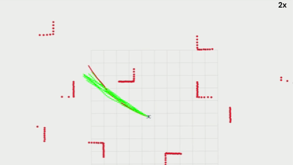

# Perception and Control of Quadrotor Drones (LOTI.05.091)

Repository associated with the course **Perception and Control of Quadrotor Drones (LOTI.05.091)**.

---
## Installation

Note that this code has only been tested with ROS-Noetic on Ubuntu 20.04. It is assumed that you already have a complete ROS installation. 

1. Set up a catkin workspace

	```
	cd
	mkdir -p bebop_2d_ws/src
	cd bebop_2d_ws
	catkin init
	```

2. Clone this repository in the workspace 

	```
	cd bebop_2d_ws/src
	git clone https://github.com/Arcane-01/Perception-and-Control-of-Quadrotor-Drones-LOTI.05.091.git -b bebop_2d .
	```
3. Install dependencies for this workspace
	```
	cd ~/bebop_2d_ws
	rosdep install --from-paths src --ignore-src -r -y
	```
4. Build the workspace

	```
	cd ~/bebop_2d_ws
	catkin build
	source devel/setup.bash
	```

## Usage: 

1. To launch the Gazebo simulation with the Jackal, run the following command:

	```
	roslaunch random_sampling_planner bebop_obs_world.launch world_name:="env3"
	```
	* `<world_name>`: Gazebo world file from [`random_sampling_planner/worlds`](random_sampling_planner/worlds) (defaults to env3)

2. To takeoff the quadrotor, run: 
	```
	rostopic pub /bebop/takeoff std_msgs/Empty "{}"
	```

3. To start the random sampling planner, run:
	```
	rosrun random_sampling_planner quadnav.py 
	```
	
4. Once the planner is running, you can begin navigation by setting a 2D Nav Goal in RViZ.

## Results

<p align="center">
	
</p>